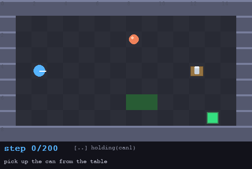
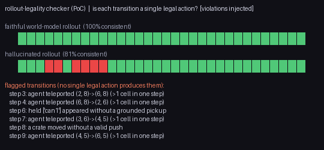

# Infinite Environment Harness

**Text command → a *provably solvable* 2D environment with a code-defined reward, exposed
through a standard RL interface — generated on demand, in code.**


*One command types a description; the harness generates an environment, **proves** it beatable
with a search oracle, labels its difficulty, and hands you a Gymnasium `Env` whose reward is
checked frame-exact against engine state. Above: the oracle solving an auto-generated
three-room, chained-key level.*

---

## The idea in one paragraph

General Intuition needs an infinite supply of environments to train and evaluate a vision-based
policy, with **code-defined ground truth** for objectives and rewards — their stated next
milestone is *"generate simulation worlds to train other agents."* This harness is that factory,
in 2D. Where **OMNI-EPIC** generates environments as *arbitrary code*, we constrain generation to
a **typed DSL**, which buys what arbitrary code can't: every generated environment is run through a
solver, and only the ones it **proves solvable** (within a search budget, within their step limit)
are **accepted** — the rest are rejected and regenerated. Acceptance extracts an **oracle plan**, and
**auto-labels difficulty** from that plan's length (plus light entity weighting). Where a **neural
world model (Genie-class)** can't give you code-defined truth,
this supplies exactly that: objectives are executable predicates checked against engine state, not
a VLM guessing at pixels. The agent that "plays" is not the product — it is a **solvability
oracle**. The product is the pipeline: **verified environments × code rewards × a standard RL
interface**, and it ends with a PPO run climbing the reward curve to prove these environments
actually feed RL.

## Quickstart (no API key needed)

```bash
uv run demo.py --offline      # full pipeline on cached, pre-verified environments (~1 min)
```

`uv` auto-provisions Python 3.12 and all wheels (pymunk/pygame-ce ship no 3.14 wheels — the pin
matters). With a key, `export ANTHROPIC_API_KEY=...` and `uv run demo.py` generates environments
live from text. No `uv`? See [requirements.txt](requirements.txt) (`pip`, Python 3.11–3.12).

**Prefer to see it in a real window?**
```bash
uv run play.py --watch          # watch the oracle solve a level live (a real game window)
uv run play.py                  # play it yourself: arrow keys / WASD to move, SPACE, R, ESC
```

## What the one command shows

```
1. TEXT COMMAND    -> environment, streamed L1 schema / L2 solvable / L3 physics logs
2. ORACLE PLAN     -> replay GIF               (proof the environment is beatable)
3. ROLLOUT         -> trace.jsonl + frames/    (pixel frame + code reward = a training shard)
4. MUTATION        -> compounding MAP-Elites evolution (objectives/entities/rooms change)
5. EVAL SCORECARD  -> success / efficiency, difficulty-stratified
6. LEGALITY CRITIC -> flags injected illegal transitions   (a direction; see below)
7. REWARD MODEL    -> pixel reward model trained on code labels (~18% held-out; GI use-case #3)
8. RL LEARNABILITY -> PPO reward curve          (the environments feed RL — the headline)
```

## Headline: provably-solvable environments that feed RL

The load-bearing result is the flywheel itself — and every piece is reproducible with no API key.
Each generated (or mutated) environment is run through the L2 solver: if there is no plan, or no
plan within its `time_limit`, it is rejected and regenerated, so **every accepted environment is
provably beatable in the engine we ship**. The oracle plan that proves it is reused three ways
(difficulty label, L3 replay witness, reward-shaping cost-to-go), and a small off-the-shelf PPO
mounted on one generated env climbs that reward to an oracle-optimal solve:


Mean reward **≈ −1.3 → 10.4** on `coins_hazard`; the trained agent solves it at oracle-optimal
length. *The same solver that proves solvability supplies the training signal.* Reproduce exactly
with `uv run --extra rl python learnability.py`; the offline flywheel (generate → verify → oracle
GIF → trace → mutate) is the top of `uv run demo.py --offline`.

**Honest caveat, made explicit (not hidden):** the shaped potential *is* the oracle's optimal value
function V\*, so shaped-reward RL is easy by construction — a zero-learning V\*-greedy policy already
solves every fixture at oracle-optimal length (`uv run python baselines.py` shows this next to a 0%
random floor). That curve proves *plumbing*, not difficulty. The honest learning test removes the
compass from **both** the reward and the observation (`reward_mode="sparse"`, `leak_goal_vectors=False`):
under it PPO still learns from scratch — on `open_can`, mean reward **1.95 → 9.9**, trained agent
solves at **oracle-optimal 9 steps** with no V\* signal anywhere (`assets/learnability_sparse.png`;
`learnability.py --reward-mode sparse --no-leak`). Long-horizon sparse fixtures (three_rooms) remain
genuinely exploration-hard — scoped as future work, not claimed.

## An agent maneuvers it — and surfaces the pixel-nav gap

The challenge asks that an agent maneuver through the generated environments — so here is **Claude
itself** (not the scripted oracle) doing it, on a generated level:



The *same* Claude on the *same* level, differing only in what it observes:

| observation | result (on `open_can`, an easy env) |
|---|---|
| **code-state** (coordinate-tagged) | solves at **oracle-optimal** length (9 steps) |
| **rendered frames only** | works but is unreliable/inefficient — 17 steps here (vs 9 optimal), and on another run it did not finish within budget |

That gap is not a bug — it is *why* GI trains a **vision-based** policy: pixel-space spatial
navigation is the unreliable part. And the generated environments are not all this easy: crate
planning (`push_delivery`) and enemy timing (`guarded can`, `patrol_gauntlet`) require real
multi-step planning — a myopic greedy agent fails them (that gap is the ACCEL regret signal). So the
factory yields a ready **training and eval ground** for exactly that vision policy. Reproduce:
`uv run --env-file .env python scripts/nav_demo.py` (needs an API key; numbers vary run to run).

## Supporting: code truth as label-free supervision for a pixel reward model

GI use-case #3 (reward-model training, code truth → pixels), concretely. The environment emits an
**exact, label-free** objective signal — `holding(can)` for every frame — free supervision. We train
a tiny pixel reward model on **only** those code labels (HUD cropped, so it reads the *scene*, not
the predicate ticks) and evaluate on **held-out (unseen) episodes**:

- **code truth** — exact, 0 error, ~microseconds, label-free.
- **trained pixel reward model** — **~18% held-out disagreement** (pickup recall 84%, not-picked
  81%): it *approximates* the code label from pixels alone. That is the point — code truth is the
  exact target a pixel/vision reward model is trained toward. `uv run --extra rl python
  scripts/train_reward_model.py` reproduces the number.

The exact code label is 0-error and label-free; the pixel model only *approximates* it — which is
precisely the point (there is no hand-tuned detector or fabricated superiority number here).

## A direction: code-truth as a rollout-legality checker

The founders authored **DIAMOND**, a diffusion world model, which motivates a natural extension: the
same `gridlogic` that proves solvability can also **check whether a rollout obeys the environment's
rules**, flagging transitions with no legal action (teleports, ungrounded pickups, no-push crate
moves). `uv run python -m harness.critic` illustrates the mechanism by *injecting* those corruptions
into an oracle rollout and catching each (faithful 100% vs hallucinated 81%):



**Honest scope:** this is a proof-of-concept, not a proven capability — the illustration plants the
violations it detects, and it operates on discrete engine **state**, not pixels. Wiring it to a
real DIAMOND-class model would require decoding predicted frames back to state (the interesting
future work). It is a *direction*, not a headline claim.

## How it maps to your research goals

| GI use case | This harness |
|---|---|
| **Post-training environments** — diverse, at scale | A **compounding MAP-Elites engine** (`evolve()`): survivors are re-fed as parents and edited by operators that change the **objective, entity roster, and room topology** — not single-edit clones. On the fixtures it lifts distinct objectives 1→11 and entity-multisets 1→11 (lineage depth 4), every child re-verified solvable and difficulty-labeled ([`mutate.py`](harness/mutate.py), [`operators.py`](harness/operators.py)). Combinatorially large within the fixed DSL vocabulary — the honest ceiling, not literally infinite. |
| **Code-level verifiable objectives** | Objectives are an **executable predicate program** checked frame-exact against engine state ([`engine/gridlogic.py`](harness/engine/gridlogic.py)) — never a VLM on pixels |
| **Reward-model training** (code truth → pixels) | Rollouts emit **(pixel frame, code-truth reward)** pairs; `harness/reward_model.py` trains a tiny CNN on **only** those code labels and reaches **~18% held-out disagreement** — a pixel reward model approximating the exact, label-free code supervision ([`scripts/train_reward_model.py`](scripts/train_reward_model.py)) |
| **2D → 3D transfer** | The Gymnasium `Env` exposes the **6-input action shape** GI's policy emits `[fwd,back,left,right,mouseDX,mouseDY]` (`action_mode="controller"`, a grid adapter: the 4 move channels select the step, mouseDX rotates the rendered facing, mouseDY is reserved) and dual `obs_mode="state"\|"pixels"` — same interface shape, swap the engine |

## Architecture

```
  text ─▶ generator ─▶ compiler ─▶ 3-STAGE VERIFIER ─▶ Gymnasium Env ─▶ { PPO | oracle | your policy }
          (Claude       (spec →     L1 schema (pydantic)  reset()/step()
           forced         world)    L2 solvable  ─┐       obs: state|pixels
           tool use +               L3 physics    │       reward: shaped + code-truth terminal
           repair loop)             (pymunk)      │
                                                  ▼
                                        ORACLE PLAN, reused 3×:
                                        (a) L3 replay witness
                                        (b) difficulty label  (plan length + weighting)
                                        (c) reward shaping     (cost-to-go)
```

Repair loop: any L1/L2/L3 failure is fed back to the generator as a structured error; it never
ships an environment it cannot prove beatable. **Hybrid engine:** navigation, keys, doors, crates
and pickups are grid-authoritative and deterministic (identical to the verifier's semantics, so
oracle plans replay frame-exact); `pymunk` drives *soft physics props* (a rolling ball) — the
physics-engine credential without physics on the critical path.

**Deadly patrolling enemies.** Enemies are not decoration — a deterministic patrol, contact = death.
The verifier searches over `(position, inventory, crates, time-phase)`, so "solvable" means *a timed
route that dodges every guard provably exists* (a guard that seals the only crossing is rejected as
unsolvable). This makes avoidance a real timing puzzle — and exactly the dynamic-obstacle signal an
RL navigation policy needs. Play one: `uv run play.py --watch --env patrol_gauntlet`.

## Diversity gallery (all cached, all verified)


## Prior art we build on

**OMNI-EPIC** (code-as-environment → we constrain to DSL-as-environment for verifiability) ·
**Voyager / EnvGen** (self-verification & feedback → our repair loop) ·
**ACCEL / PAIRED** (regret-driven curation → our binary regret-proxy mutation selection) ·
**Sokoban/Mario PCG** (generate-then-solver-verify → our L2 solvability gate). See
[DESIGN.md](DESIGN.md) for the full mapping.

## Limitations & the 3D path

- The L2 solver is sound + complete over `(agent, inventory, crates, enemy time-phase)` **within a
  400k-state search budget**; past it we conservatively reject (never a false "solvable"). We keep
  mechanics where BFS stays cheap (lock-key, hazards, single-cell pushes, short-period patrols) and
  deliberately avoid PSPACE traps.
- Physics is decorative by design; game logic is discrete. That is a feature (deterministic
  verification), and the boundary is explicit.
- **3D:** the observation/action/reward *interface* is the transfer unit. The tile IR generalizes
  to a scene-graph/voxel IR; the generator, difficulty labeling, reward-shaping machinery and the
  Gymnasium interface carry over — but the **discrete BFS solvability proof must be replaced** for a
  continuous 3D world (a sampling-based planner / reachability check). Farama's MiniGrid→Miniworld
  share one Gymnasium API — the same compile-target swap this harness is built around.

## Repo layout

```
demo.py            one-command pipeline (--offline works with no API key)
play.py            open a real window: play a level yourself, or --watch the oracle solve it
evaluate.py        scorecard + code-vs-pixel contrast (--vlm --live for a Claude judge)
learnability.py    PPO capstone (optional: uv run --extra rl)
harness/
  dsl/schema.py    the typed DSL (pydantic model + tool-use schema)
  generator.py     Claude forced tool use + repair loop
  compiler.py      spec -> world
  verifier.py      L1/L2/L3 + oracle plan + difficulty + cost-to-go field
  engine/          gridlogic (semantics), world (hybrid + pymunk), renderer
  gym_env.py       Gymnasium Env (dual obs, controller adapter, shaped reward)
  agents/          scripted oracle, greedy probe, Claude state/pixel agents
  mutate.py        mutate() single-edit + evolve() compounding MAP-Elites archive
  operators.py     edit operators (add/remove entities, change objective, partition rooms)
  eval.py          scorecard + code-vs-pixel illustration
  reward_model.py  tiny pixel reward model trained on code-truth labels (GI use-case #3)
  critic.py        rollout-legality checker (proof-of-concept / direction)
  fixtures.py      canonical environments (offline cache + tests)
specs/             pre-verified environments (JSON) for --offline
assets/            README media (regenerate: uv run python scripts/build_assets.py)
```

Reproduce everything: `uv run python scripts/build_specs.py && uv run python scripts/build_assets.py`.
Tests: `uv run --with pytest pytest -q` — the full smoke suite; the generator's tool-use + repair
loop is covered via a mocked client, and the Gymnasium env passes
`gymnasium.utils.env_checker.check_env`, so the online path and the RL interface are both exercised
without an API key.
