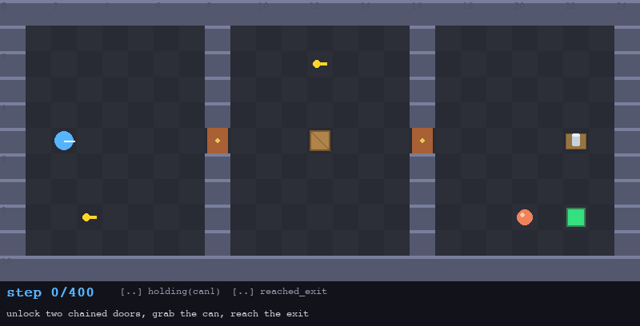
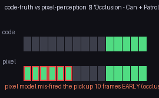
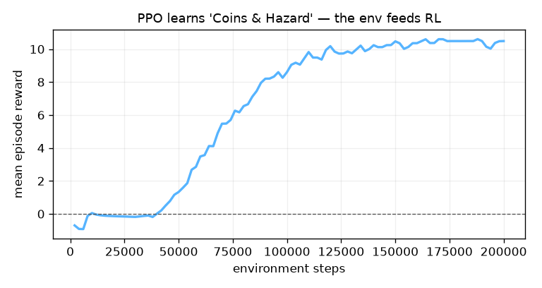
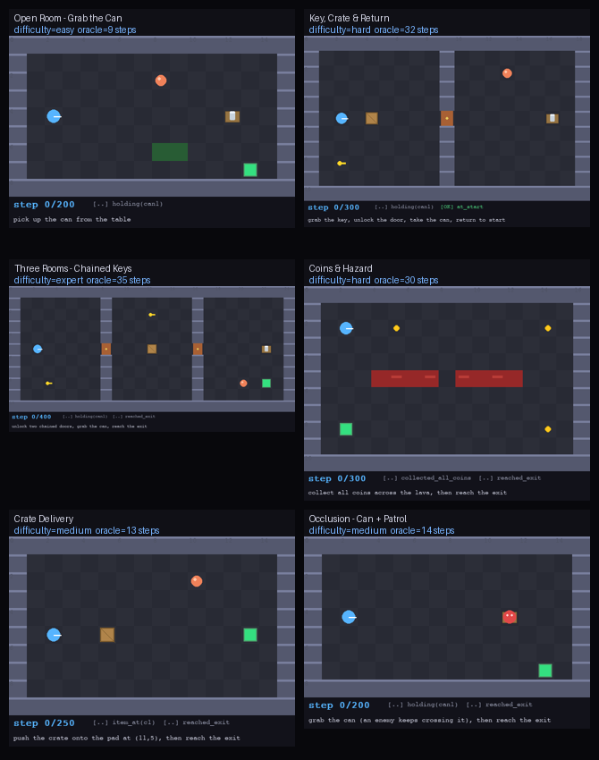

# Infinite Environment Harness

**Text command → a *provably solvable* 2D environment with a code-defined reward, exposed
through a standard RL interface — minted infinitely, in code.**



*One command types a description; the harness generates an environment, **proves** it beatable
with a search oracle, labels its difficulty, and hands you a Gymnasium `Env` whose reward is
checked frame-exact against engine state. Above: the oracle solving an auto-generated
three-room, chained-key level.*

---

## The idea in one paragraph

General Intuition needs an infinite supply of environments to train and evaluate a vision-based
policy, with **code-defined ground truth** for objectives and rewards — their stated next
milestone is *"generate simulation worlds to train other agents."* This harness is that factory,
in 2D. Where **OMNI-EPIC** generates environments as *arbitrary code*, we constrain generation to
a **typed DSL**, which buys what arbitrary code can't: every environment is run through a solver
that **proves it is solvable**, extracts an **oracle plan**, and **auto-labels difficulty** from
that plan's length. Where a **neural world model (Genie-class)** can't give you code-defined truth,
this supplies exactly that: objectives are executable predicates checked against engine state, not
a VLM guessing at pixels. The agent that "plays" is not the product — it is a **solvability
oracle**. The product is the pipeline: **verified environments × code rewards × a standard RL
interface**, and it ends with a PPO run climbing the reward curve to prove these environments
actually feed RL.

## Quickstart (no API key needed)

```bash
uv run demo.py --offline      # full pipeline on cached, pre-verified environments (~1 min)
```

`uv` auto-provisions Python 3.12 and all wheels (pymunk/pygame-ce ship no 3.14 wheels — the pin
matters). With a key, `export ANTHROPIC_API_KEY=...` and `uv run demo.py` generates environments
live from text. No `uv`? See [requirements.txt](requirements.txt) (`pip`, Python 3.11–3.12).

## What the one command shows

```
1. TEXT COMMAND   -> environment, streamed L1 schema / L2 solvable / L3 physics logs
2. ORACLE PLAN    -> replay GIF                (proof the environment is beatable)
3. ROLLOUT        -> trace.jsonl              (pixels + code reward = a training shard)
4. MUTATION       -> 10 NEW verified envs      (ACCEL-curated, auto difficulty labels)
5. EVAL SCORECARD -> success / efficiency, difficulty-stratified
6. CODE vs PIXEL  -> the headline (below)
7. RL LEARNABILITY-> PPO reward curve          (the environments feed RL)
```

## The headline: code-truth vs pixel perception

GI's own rationale — *"code-level objectives are far more reliable than a VLM checking pixels"* —
made measurable. On the **same** saved frames, a frame-exact code predicate is compared against a
perception model detecting *"the can has been picked up."* An enemy patrol occludes the can:



The pixel model **mis-fires the pickup 10 frames early** (occlusion looks like removal) and is
**~200× slower**; the code predicate is exact and ~free. Offline it uses a deterministic pixel
detector (reproducible, no API); `uv run python evaluate.py --vlm --live` swaps in a Claude VLM
judge on the same frames. *This is the piece that turns GI's premise into a number.*

## These environments feed RL



A small off-the-shelf PPO (stable-baselines3) mounted on one generated env: mean reward climbs
**−0.7 → 10.5** and the trained agent solves it at **oracle-optimal** length. The reward it climbs
is potential shaping sourced from the oracle cost-to-go plus the sparse code-truth terminal — *the
same solver that proves solvability supplies the training signal.* (`uv run --extra rl python
learnability.py`.)

## How it maps to your research goals

| GI use case | This harness |
|---|---|
| **Post-training environments** — diverse, at scale | DSL generation + **mutation engine**: infinitely many environments, each re-verified solvable and difficulty-labeled ([`mutate.py`](harness/mutate.py)) |
| **Code-level verifiable objectives** | Objectives are an **executable predicate program** checked frame-exact against engine state ([`engine/gridlogic.py`](harness/engine/gridlogic.py)) — never a VLM on pixels |
| **Reward-model training** (code truth → pixels) | Every rollout emits `trace.jsonl` of **(pixel frame, code-truth reward)** pairs; the code-vs-pixel contrast quantifies the gap a reward model would close |
| **2D → 3D transfer** | The Gymnasium `Env` exposes GI's exact **6-number controller contract** `[fwd,back,left,right,mouseDX,mouseDY]` (`action_mode="controller"`) and dual `obs_mode="state"\|"pixels"` — swap the engine, keep the interface |

## Architecture

```
  text ─▶ generator ─▶ compiler ─▶ 3-STAGE VERIFIER ─▶ Gymnasium Env ─▶ { PPO | oracle | your policy }
          (Claude       (spec →     L1 schema (pydantic)  reset()/step()
           strict         world)    L2 solvable  ─┐       obs: state|pixels
           tool use +               L3 physics    │       reward: shaped + code-truth terminal
           repair loop)             (pymunk)      │
                                                  ▼
                                        ORACLE PLAN, reused 3×:
                                        (a) L3 replay witness
                                        (b) difficulty label  (plan length)
                                        (c) reward shaping     (cost-to-go)
```

Repair loop: any L1/L2/L3 failure is fed back to the generator as a structured error; it never
ships an environment it cannot prove beatable. **Hybrid engine:** navigation, keys, doors, crates
and pickups are grid-authoritative and deterministic (identical to the verifier's semantics, so
oracle plans replay frame-exact); `pymunk` drives *soft physics props* (a rolling ball) — the
physics-engine credential without physics on the critical path.

## Diversity gallery (all cached, all verified)



## Prior art we build on

**OMNI-EPIC** (code-as-environment → we constrain to DSL-as-environment for verifiability) ·
**Voyager / EnvGen** (self-verification & feedback → our repair loop) ·
**ACCEL / PAIRED** (minimax-regret curation → our mutation selection) ·
**Sokoban/Mario PCG** (generate-then-solver-verify → our L2 solvability gate). See
[DESIGN.md](DESIGN.md) for the full mapping.

## Limitations & the 3D path

- The L2 solver is sound+complete over `(agent, inventory, crates)`; we keep mechanics where BFS
  stays cheap (lock-key, hazards, single-cell pushes) and deliberately avoid PSPACE traps.
- Physics is decorative by design; game logic is discrete. That is a feature (deterministic
  verification), and the boundary is explicit.
- **3D:** the observation/action/reward *interface* is the transfer unit. The tile IR generalizes
  to a scene-graph/voxel IR; generator, verifier, difficulty labeling and the reward-shaping
  machinery carry over unchanged. Farama's MiniGrid→Miniworld share one Gymnasium API — the same
  compile-target swap this harness is built around.

## Repo layout

```
demo.py            one-command pipeline (--offline works with no API key)
evaluate.py        scorecard + code-vs-pixel contrast (--vlm --live for a Claude judge)
learnability.py    PPO capstone (optional: uv run --extra rl)
harness/
  dsl/schema.py    the typed DSL (pydantic model + tool-use schema)
  generator.py     Claude strict tool use + repair loop
  compiler.py      spec -> world
  verifier.py      L1/L2/L3 + oracle plan + difficulty + cost-to-go field
  engine/          gridlogic (semantics), world (hybrid + pymunk), renderer
  gym_env.py       Gymnasium Env (dual obs, controller contract, shaped reward)
  agents/          scripted oracle, greedy probe, Claude state/pixel agents
  mutate.py        ACCEL-style curated mutation
  eval.py          scorecard + contrast
  fixtures.py      canonical environments (offline cache + tests)
specs/             pre-verified environments (JSON) for --offline
assets/            README media (regenerate: uv run python scripts/build_assets.py)
```

Reproduce everything: `uv run python scripts/build_specs.py && uv run python scripts/build_assets.py`.
Tests: `uv run --with pytest pytest -q` (13 smoke tests; the generator's tool-use + repair loop
is covered via a mocked client, so the online path is exercised without an API key).
